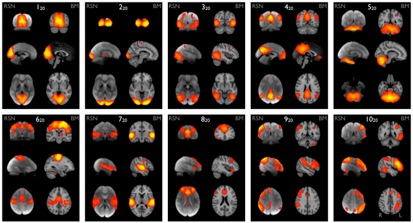

# Critical thinking example: 'We only use 10% of our brain.'

We don’t use only 10% of our brain:\
Imaging brains with functional Magnetic Resonance Imaging (fMRI) at rest shows that >10% of the brain (>10%) is active.
Injuries to the brain would most likely lead to some form of impairment:\
Many neuropsychological studies show that patients with brain damage are impaired in aspects like decision-making, facial recognition, language processing etc.. \
(entirely depends on where in the brain is damaged)
Conclusion: The claim that ‘we only use 10% of our brain’ is not supported by evidence .\
It is important that we don’t whole-heartedly accept a claim until we evaluate them logically. \

```{r my-fig, fig.cap="Taken from Smith et al (2008), PNAS"}

```
